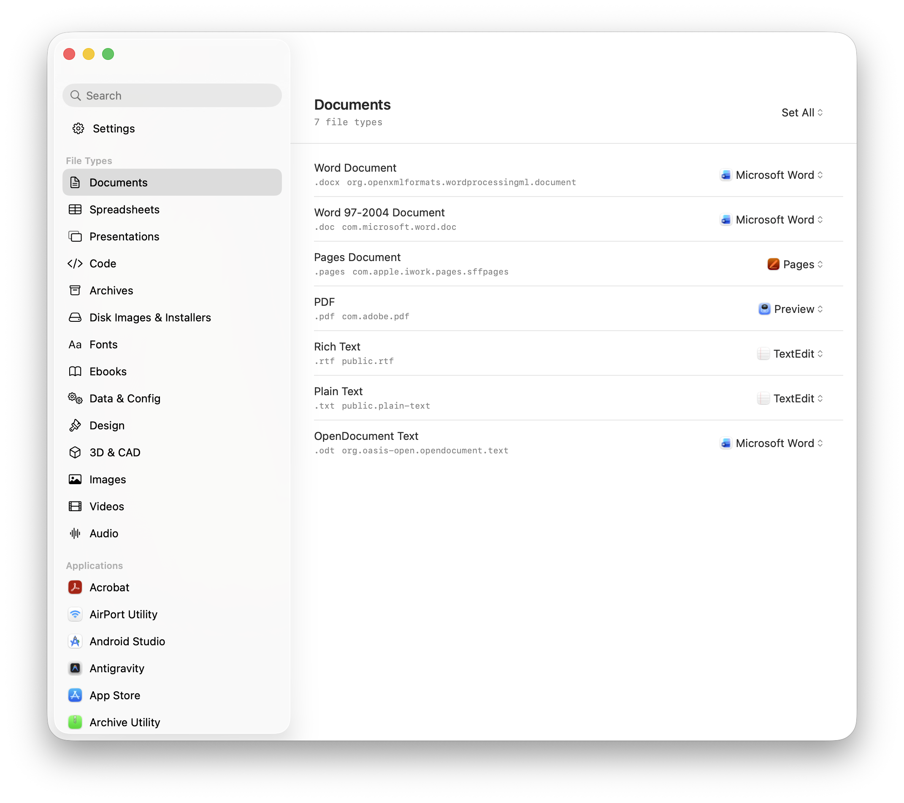
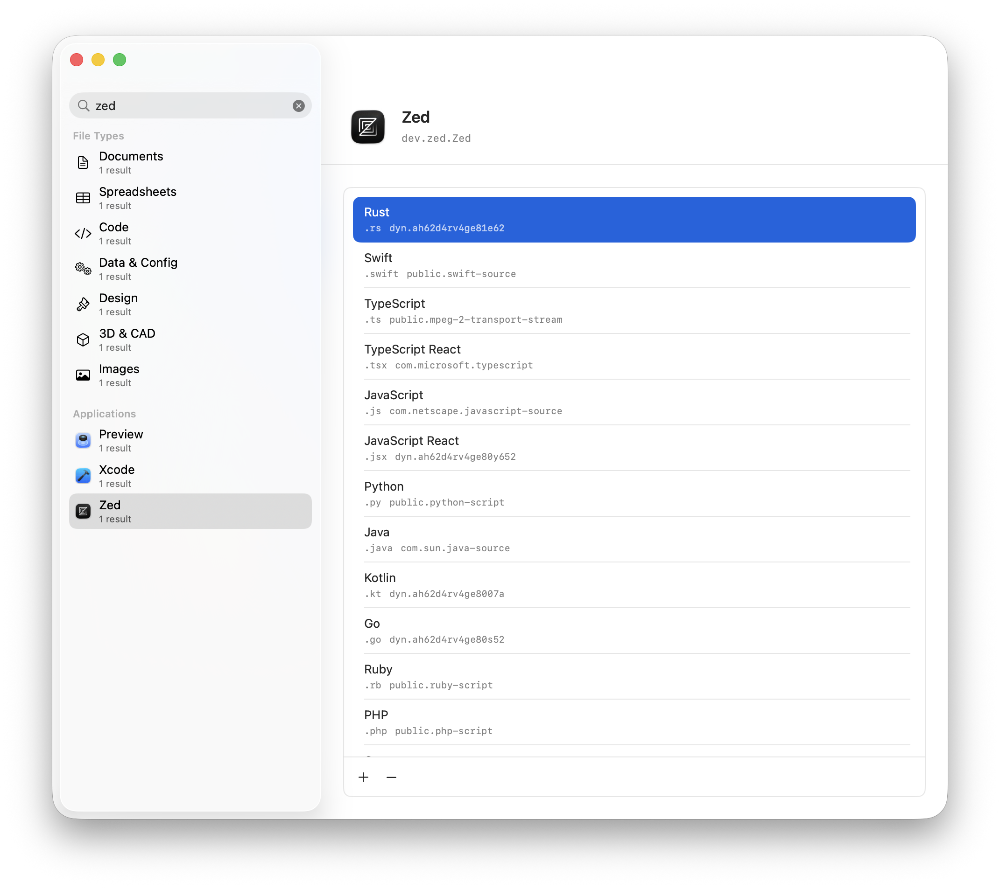

# Default Mac App

A native SwiftUI macOS menu bar app for changing the current user's Finder/open default app for every file type.

[Download](https://github.com/emilianscheel/default-mac-app/releases/latest/download/Default-Mac-App.dmg)





## Build and Run

```sh
xcodebuild -project DefaultAppManager.xcodeproj -scheme DefaultAppManager -configuration Debug -derivedDataPath .build/DerivedData build
open ".build/DerivedData/Build/Products/Debug/Default Mac App.app"
```
